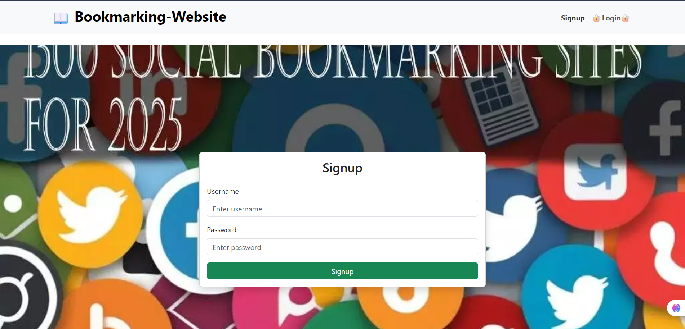
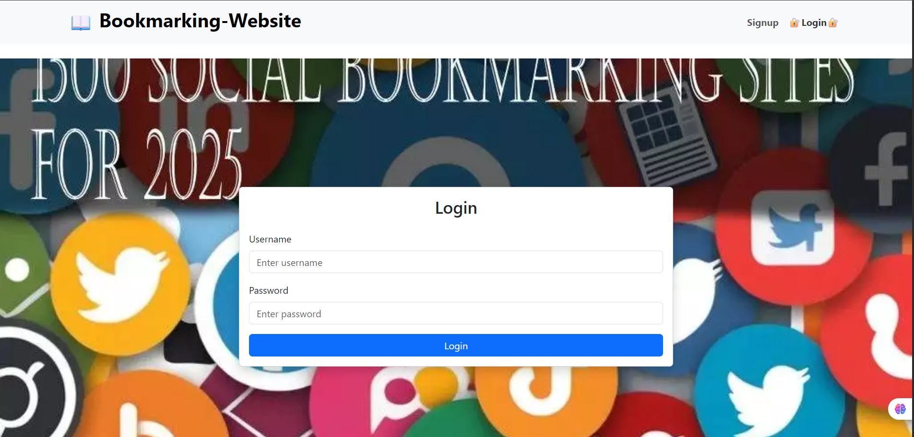
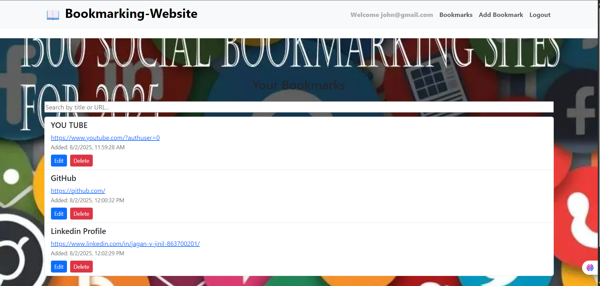
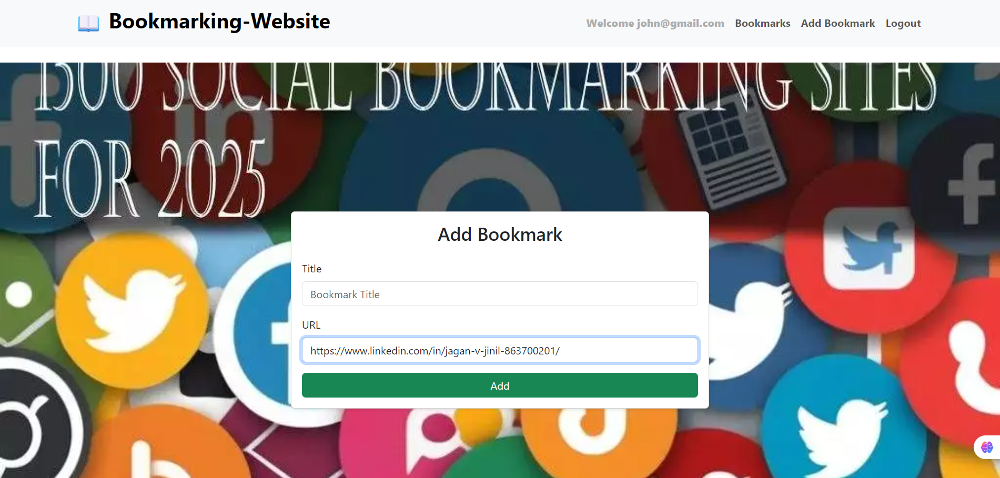

# 📑 Bookmarking Website

A full-featured web application built using React, Redux, and Axios that allows users to manage personal bookmarks. Users can securely sign up, log in, and manage up to 5 custom bookmarks with features like pagination, search, edit, and delete.

### 🚀 Features
✅ Authentication
User signup & login with persistent authentication

###  Signup

###  Login

Uses localStorage to maintain session state

🔖 Bookmark Management
Add, edit, delete, and view bookmarks (title + URL)

Limit of 5 bookmarks per user

Timestamp displayed on each bookmark

### 📋 Bookmarks List

###  Add Bokmark

🔍 Advanced Listing
Search functionality to quickly find bookmarks

Pagination for smooth navigation across bookmarks

### ⚙️ Tech Stack

| **Category**     | **Technology**                |
|------------------|-------------------------------|
| Frontend         | React, JavaScript, HTML, CSS  |
| State Management | Redux                         |
| HTTP Client      | Axios                         |
| Routing          | React Router                  |
| Styling          | Modern CSS (Responsive UI)    |
| Authentication   | Local Storage (Client-side)   |
| Form Handling    | React Forms + Validations     |

🧠 Key Highlights
-Robust state management with Redux.
-Form validation for inputs (URLs, titles).
-Protected routes for authenticated users.
-Minimal, clean, and responsive UI.
